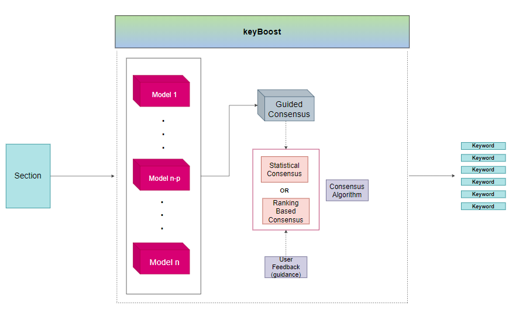

[](https://zenodo.org/badge/latestdoi/389295849)
[](https://colab.research.google.com/drive/19oAPrqmfeO_1F_losdF8hvuN5iq-HtVa?usp=sharing)

<p align = 'center'>  </p>

# KeyBoost

KeyBoost is simple and easy-to-use keyword extraction tool that moves away the hassle of selecting the best models for your specific use-case. No background in the litterature of keyword extraction or expertise is needed to extract the *best* possible keywords given no prior knowledge of what are the most performant models for your task.

KeyBoost has the structure of a *meta-model* that consolidates the keyword extractions from many models in a way that forms a global *consensus* on the most relevant keywords.

A technical deep dive on the ins and outs of this architecture is availaible [here](#note_technique).

<a name="toc"/></a>
## Table of Contents  
<!--ts-->
   1. [About the Project](#about)  
   2. [Getting Started](#gettingstarted)    
        2.1. [Installation](#installation)    
        2.2. [Basic Usage](#usage)
<!--te-->


<a name="about"/></a>
## 1. About the Project
[Back to ToC](#toc)  

Wishing to apply keyword extraction to ecology-related administrative documents, I was confronted to the large breadth of available techniques making any kind of arbitrage between them frustrating for a number of reasons.

* I did not have any labeled data for my use-case to test the models on. I had thus no visibility on the real performance of theses algorithms.
* A brief review of keyword extraction litterature emphasized on the fact that there is a large amount of models that performs very differently from a use-case to another (in terms ofcorpus type, writing style, etc)
* Just randomly picking a model was not satisfactory, I wanted a rational and structured approach to deal with this incertainty situation in a manner that could, by the way, benefit the many facing the same challenges.

<p align = 'center'>  </p>

This is really where keyBoost comes in. As briefly exposed above, this tool works ont the basis of the keywords generated by a handpicked set of models and selects the most relevant ones via a consensus which can intuitively sound like a vote. For the moment, there is two kind of consensus mechanisms:

* *Statistical Consensus* which processes scores outputed by the models in order to constitute a set of relevant keywords, in a *cardinal fashion*.
* *Ranking-based Consensus* relies directly and very simply on the rankings to generates its choice, in an *ordinal fashion*.

A forthcoming release will add the ability to take in user feedback as guiding information for this consensus.

The 3 main sub-models keyBoost is based upon are [YAKE!](https://github.com/LIAAD/yake), [KeyBERT](https://github.com/MaartenGr/KeyBERT) and [TextRank](https://github.com/RaRe-Technologies/gensim). This choice reflects the intention to provide  
diversity in terms of the typology of techniques used (*statiscal* for YAKE!, *Deep learning* for KeyBert and *Graphs*  for TextRank). This variety is thought to  be able to fit to the maximum cases possible leveraging models that are *best in class* and with great implementations available.


keyBoost is disigned with the yearning to provide a simple and easy out-of-the-box tool for keyword extraction with the least compromise possible. The goal is to generate the most relevant keywords given no expertise in the field with just a few lines of code.

<a name="gettingstarted"/></a>
## 2. Getting Started
[Back to ToC](#toc)  

<a name="installation"/></a>
###  2.1. Installation
Installation can very simply be done using [pypi](https://pypi.org/project/keybert/):

```
pip install git+https://github.com/IIZCODEII/keyboost.git#egg=keyboost
```

<a name="usage"/></a>
###  2.2. Basic Usage

The basic task of extracting keywords from a document with keyBoost can be done in a few lines of code :

```python
from keyboost.keyBoost import *

doc = """
         Supervised learning is the machine learning task of learning a function that
         maps an input to an output based on example input-output pairs. It infers a
         function from labeled training data consisting of a set of training examples.
         In supervised learning, each example is a pair consisting of an input object
         (typically a vector) and a desired output value (also called the supervisory signal).
         A supervised learning algorithm analyzes the training data and produces an inferred function,
         which can be used for mapping new examples. An optimal scenario will allow for the
         algorithm to correctly determine the class labels for unseen instances. This requires
         the learning algorithm to generalize from the training data to unseen situations in a
         'reasonable' way (see inductive bias).
      """
keyboost = KeyBoost('paraphrase-MiniLM-L6-v2')
keywords = keyboost.extract_keywords(text=doc,
                       language='en',
                       n_top=10,
                       keyphrases_ngram_max=2,
                       consensus='statistical',
                       models=['keybert','yake','textrank'])
```

You can intuitively fine tune the results by:
* setting `keyphrase_ngram_range` to the top bound length you would like for the keyphrases
* setting `n_top` in accordance with the number of keywords you want
* setting `consensus` to either *statistical* or *rank*
* selecting only a subset of the 3 main models in `models`

For a more detailed introduction to the capabilities of keyboost, a tutorial is availaible here [](https://colab.research.google.com/drive/19oAPrqmfeO_1F_losdF8hvuN5iq-HtVa?usp=sharing)


## Citation
To cite keyBoost in your work, please use the following bibtex reference:

```bibtex
@misc{bekkar2021keyboost,
  author       = {Zakaria Bekkar},
  title        = {keyBoost: Consensus Meta-Model for Keyword Extraction.},
  year         = 2021,
  publisher    = {Zenodo},
  version      = {v0.1},
  doi          = {10.5281/zenodo.5136971},
  url          = {https://doi.org/10.5281/zenodo.5136971}
}
```

## References

**Papers**:  
* Large-Scale Evaluation of Keyphrase Extraction Models, Boudin, Daille and Gallina, 2020
* Automatic keyphrase extraction : a survey of the state of the art, Hasan and Ng, 2014
* YAKE! Keyword extraction from single documents using multiple local features, Campos et al., 2020
* TextRank: Bringing Order into Text, Mihalcea and Tarau, 2004

**Github Repos**:  
* https://github.com/MaartenGr/KeyBERT
* https://github.com/LIAAD/yake
* https://github.com/RaRe-Technologies/gensim
